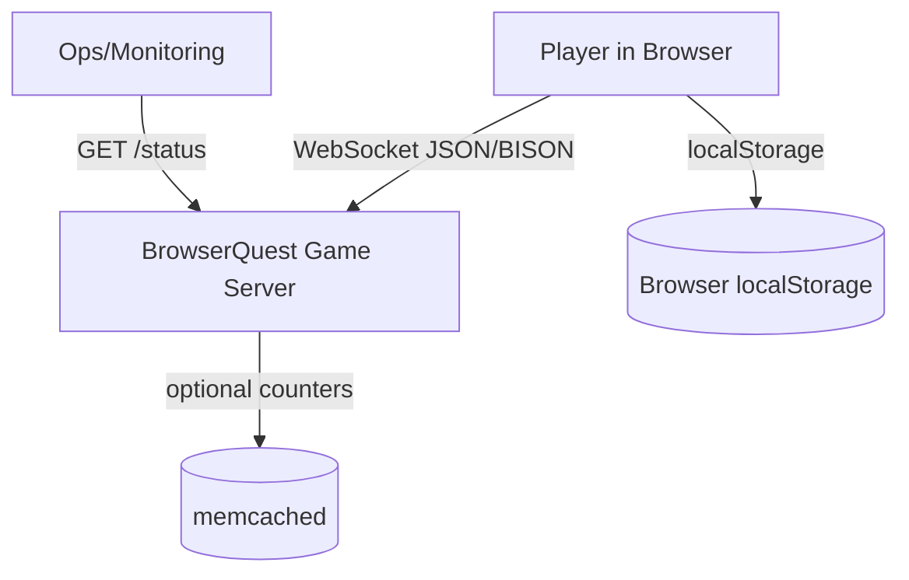
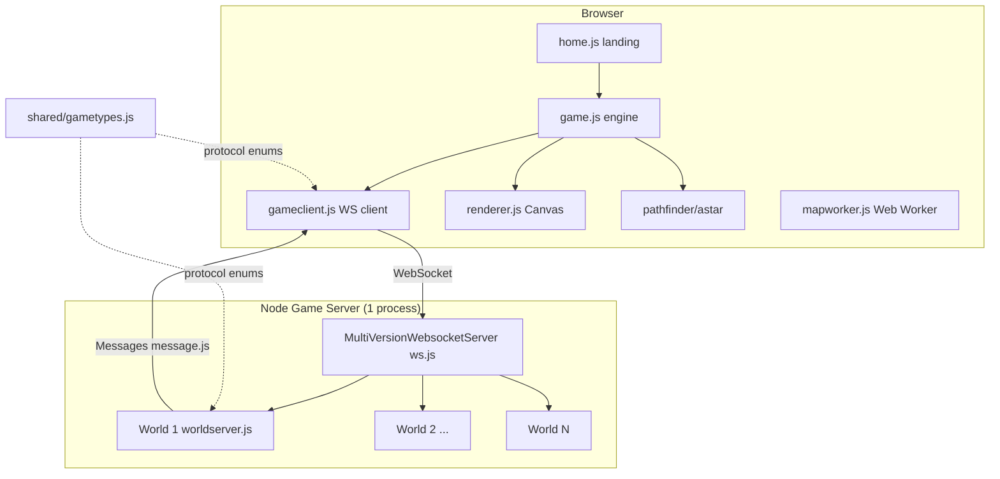
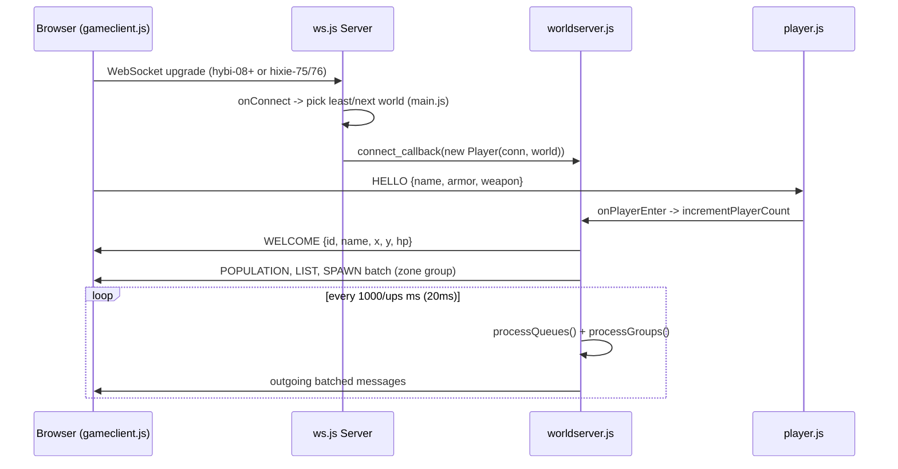
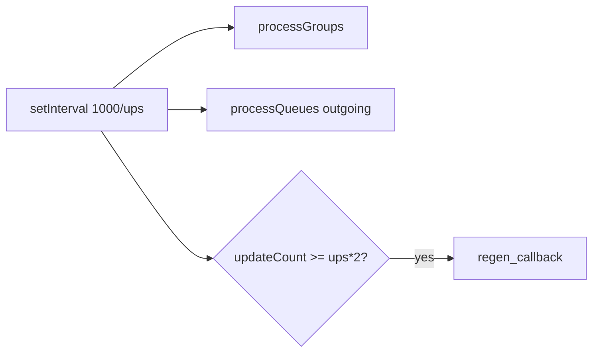

# BrowserQuest — Architecture Document

> Audited evidence base for the modernization plan. Every non-obvious claim is
> cited to a local file (and line range where it pins something specific).
> Markers: `[INFERRED]` = reasoned but not explicitly stated; `[UNVERIFIED]` =
> repeated from a doc but not re-measured.

## Local checkout identity

| Property | Value | Evidence |
|----------|-------|----------|
| Remote | `https://github.com/mozilla/BrowserQuest.git` | `git remote -v` |
| Branch | `master` | `git branch --show-current` |
| HEAD commit | `af32d247cac3495ca430d0effbb88dd5f3250b2c` — "Update map exporter docs", 2012-04-10 | `git log -1` |
| Version | `0.0.1` | `package.json:3` |
| License | Code MPL 2.0, content CC-BY-SA 3.0 | `README.md:16`, `LICENSE` |

**This is the original Mozilla BrowserQuest, frozen at its 2012 state.** The most
recent commit is over a decade old. Nothing in this document assumes any newer
remote state.

---

## Part 1 — Whole-repo technical deep-dive

### What it is

BrowserQuest is an HTML5/JavaScript multiplayer (MMORPG-style) game experiment: a
top-down, tile-based world rendered on `<canvas>`, with many players connecting
over WebSockets to instanced game worlds running on a Node.js server
(`README.md:4`). It is a tech demo Mozilla published to showcase WebSockets and
canvas, not a production product.

### Tech-stack detection table

| Layer | Technology | Evidence (file + line) |
|-------|------------|------------------------|
| Server runtime | Node.js (originally v0.4.7) | `server/README.md:4` |
| Server deps | `underscore`, `log`, `bison`, `websocket`, `websocket-server`, `sanitizer`, `memcache` | `package.json:5-13`, `server/README.md:6-12` |
| WebSocket (modern) | `websocket` (Worlize WebSocket-Node) | `server/js/ws.js:7,157-161` |
| WebSocket (legacy fallback) | `websocket-server` (miksago, hixie-75/76/hybi-00) | `server/js/ws.js:4-5,138-152,171-178` |
| Wire format | JSON, optional BISON binary encoding (`useBison` flag, default off) | `server/js/ws.js:11-12,212-244` |
| Metrics store | memcached (optional) | `server/js/metrics.js:10`, `server/config.json:7` |
| OOP base | Simple John Resig-style `Class.extend` | `server/js/lib/class.js`, `client/js/lib/class.js` |
| Client framework | jQuery + RequireJS (AMD) | `client/index.html:356`, `client/js/build.js:9` |
| Client rendering | HTML5 Canvas (3 layers: background/entities/foreground) | `client/js/main.js:170-173` |
| Client pathfinding | A* (`astar.js`) | `client/js/lib/astar.js`, `client/js/pathfinder.js` |
| Feature detection | Modernizr + custom `detect.js` | `client/index.html:32,40` |
| Map loading | Web Worker (`mapworker.js`) on desktop | `client/js/main.js:180-181` |
| Client build | RequireJS optimizer (`r.js`), UglifyJS | `bin/build.sh:15`, `client/js/build.js:5` |
| Map authoring | Tiled `.tmx` → Python (`lxml`) + Node exporter | `tools/maps/README.md`, `tools/maps/export.py` |
| Shared code | `shared/js/gametypes.js` (entity + message enums) | `server/js/worldserver.js:18`, `shared/js/gametypes.js` |

### Entry points

- **Server:** `server/js/main.js` — reads config, spins up
  `MultiVersionWebsocketServer`, creates N worlds, assigns connections to worlds
  (`server/js/main.js:6-100`). Started with `node server/js/main.js`
  (`server/README.md:29`).
- **Client (landing page):** `client/index.html` loads via RequireJS
  `data-main="js/home"` (`client/index.html:356`).
- **Client (game bootstrap):** `client/js/main.js` → `app.js` → lazy-`require('game')`
  (`client/js/main.js:2,167-168`).

### Build / run / test / lint commands

| Action | Command | Evidence |
|--------|---------|----------|
| Install server deps | `npm install -d` | `server/README.md:14` |
| Run server | `node server/js/main.js [configPath]` | `server/README.md:29`, `server/js/main.js:122-129` |
| Build client | `cd bin && ./build.sh` | `client/README.md:14-17`, `bin/build.sh` |
| Health check | `GET http://[host]:[port]/status` | `server/README.md:40`, `server/js/ws.js:122-128` |
| Export map | `cd tools/maps && ./export.py client` and `./export.py server` | `tools/maps/README.md` |

**There is no test suite, no linter config, and no CI configuration anywhere in
the repo.** `[INFERRED from absence]` — no `test/` dir, no `.eslintrc`, no
`.travis.yml`/`.github/workflows`, and `package.json` has no `scripts` block
(`package.json:1-14`).

### Directory layout

| Path | Purpose | Evidence |
|------|---------|----------|
| `server/js/` | All server game logic (22 modules, ~3,087 LOC) | `wc -l server/js/*.js` |
| `server/js/lib/class.js` | `Class.extend` base for server OOP | `server/js/lib/` |
| `server/maps/world_server.json` | Server-side collision/spawn map data | `server/config.json:6` |
| `client/js/` | All client game logic (~21,404 LOC incl. vendored libs) | `wc -l client/js/**` |
| `client/js/lib/` | Vendored libraries (jQuery, underscore, astar, bison, modernizr, etc.) | `client/js/lib/` |
| `client/config/` | Build/runtime host+port config (`config_build.json`, `config_local.json`) | `client/README.md:8`, `client/config/` |
| `client/img/`, `audio/`, `sprites/`, `fonts/`, `css/` | Static game assets | repo tree |
| `shared/js/gametypes.js` | Entity kinds + message-type enums shared client↔server | `shared/js/gametypes.js`, `server/js/worldserver.js:18` |
| `bin/` | `build.sh` + vendored `r.js` (RequireJS optimizer, 344 KB) | `bin/` |
| `tools/maps/` | Tiled `.tmx` → JSON map exporter (Python + Node) | `tools/maps/` |

### Server module map (`server/js/`)

| Module | Responsibility | Evidence |
|--------|----------------|----------|
| `main.js` | Bootstrap, config load, world allocation, status endpoint | `server/js/main.js` |
| `ws.js` | Multi-version WebSocket server + connection abstraction | `server/js/ws.js` |
| `worldserver.js` | Core game loop, entity/zone/group management (~27 KB, largest module) | `server/js/worldserver.js` |
| `player.js` | Player state, inventory, combat, chat (13.7 KB) | `server/js/player.js` |
| `mob.js` / `mobarea.js` | Mobs and roaming/spawn areas | `server/js/mob.js`, `mobarea.js` |
| `map.js` | Server map load + collision grid + zone groups | `server/js/map.js` |
| `message.js` | Outgoing message serialization (matches `gametypes`) | `server/js/message.js` |
| `entity.js` / `character.js` / `item.js` / `chest.js` / `npc.js` | Entity hierarchy | respective files |
| `area.js` / `checkpoint.js` / `chestarea.js` | Spatial regions | respective files |
| `metrics.js` | Optional memcached population counters | `server/js/metrics.js` |
| `playerstore.js` | Optional player persistence: `PlayerStore` (SQLite/in-memory), token minting, `SessionRegistry` (Phase 4) | `server/js/playerstore.js` |
| `format.js` / `formulas.js` / `properties.js` / `utils.js` | Message validation, damage/HP formulas, mob/item stats, helpers | respective files |

### Data / storage layers

- **No database by default.** Game state is in-memory per world process
  (`server/js/worldserver.js:33-43`). With persistence disabled (the default),
  quitting loses everything. `[INFERRED]` confirmed by absence of any DB driver
  in the original dep tree.
- **Optional player persistence (Phase 4).** Behind `persistence_enabled`
  (`server/config.json`), a `PlayerStore` (`server/js/playerstore.js`) persists a
  reconnecting player's `name`, equipped armor/weapon, position, orientation, and
  last checkpoint id, keyed by a server-issued anonymous opaque **bearer token**
  (`crypto.randomUUID`). Default backend is SQLite (`better-sqlite3`, WAL); an
  in-memory store exists as a test double / dev mode. The token is appended to
  WELCOME and stored client-side in `localStorage`; the client re-presents it in
  HELLO (optional 4th param) on reconnect. A process-wide `SessionRegistry`
  fences duplicate-token logins (the newer session supersedes the older; a
  superseded session's save is ignored), and loaded data is validated as
  untrusted. When the flag is off, no token is minted and WELCOME is byte-for-byte
  the original 6 fields. Persistence assumes single-host (in-process registry +
  local SQLite file).
- **Client-side persistence:** browser `localStorage` via `client/js/storage.js`
  holds the player name, achievements, "has played" flag, and (Phase 4) the
  reconnect token (`client/js/main.js:139-145`).
- **memcached:** only used for cross-process *population counters*, not game
  state, and only when `metrics_enabled` (`server/js/metrics.js:28-63`,
  `server/config.json:7`).

### APIs

- **WebSocket protocol** is the primary API. Messages are integer-tagged arrays;
  the message vocabulary is the `Types.Messages` enum shared by both sides
  (`shared/js/gametypes.js:3-30`+). HELLO/WELCOME/SPAWN/MOVE/ATTACK/CHAT/ZONE etc.
- **HTTP `/status`** returns a JSON array of per-world player counts
  (`server/js/ws.js:122-128`, `server/js/main.js:87-89`).

### Background jobs

- **World game loop:** `setInterval` at `1000/ups` (ups = 50, i.e. 20 ms tick)
  drives `processGroups()` + `processQueues()`, with mob/item regeneration every
  `ups*2` ticks (`server/js/worldserver.js:29,189-203`).
- **Population poll:** `setInterval` every 1 s in `main.js` reconciles total
  players across worlds via metrics (`server/js/main.js:15-26`).

### CI/CD & testing

None present. No CI config, no automated tests, no lint. Build is a manual shell
script (`bin/build.sh`). Deployment is "copy `server` + `shared` to the host and
`node server/js/main.js`" (`server/README.md:24-32`); client is built then the
`client-build/` directory copied anywhere (`client/README.md:19-23`).

---

## Part 2 — Context & ecosystem

### Repo-specific contributor docs

- `README.md` — one-paragraph project description + license/credits.
- `server/README.md` — deps, configuration, deployment, monitoring.
- `client/README.md` — build + deploy steps; emphasizes the **`client/` dir must
  never be deployed directly** — only the optimized `client-build/`
  (`client/README.md:4`).
- `tools/maps/README.md` — map exporter usage, explicitly flagged as "messy /
  never meant to be publicly released" (`tools/maps/README.md:3`).

No `AGENTS.md`, `CONTRIBUTING.md`, or `CODEOWNERS`.

### Developer gotchas

- **`shared/` is the only server dependency outside `server/`**
  (`server/README.md:32`) — copy it alongside `server/` or the server won't boot
  (`server/js/worldserver.js:18`).
- **Client build prunes files by name.** `build.sh` deletes everything in
  `client-build/js` except an explicit allow-list (`bin/build.sh:19`); adding a
  new top-level entry module means editing that list.
- **Global `log`/`Types` leakage.** Server code references a bare global `log`
  set up in `main.js` (`server/js/main.js:28-37`) and `Types` as an implicit
  global (`shared/js/gametypes.js:2`); modules assume these exist.
- **Two WebSocket stacks coexist** to support 2012-era browser protocol drafts
  (`server/js/ws.js:90-180`) — a major source of complexity that is now obsolete.
- **Map export is slow and OSX-centric** (`tools/maps/README.md`), needs Python +
  `lxml` + Node, and has no one-step both-targets command.

### Ecosystem relationship (as visible on disk)

- The `shared/js/gametypes.js` module is loaded by both the Node server
  (`module.exports` branch, `shared/js/gametypes.js` tail) and the browser client
  (global `Types`), making it the **single source of truth for the wire
  protocol**. Client and server must be deployed in lockstep on protocol changes.
  `[INFERRED]` — no version negotiation exists beyond the HELLO message.
- memcached + the `game_servers` config array (`server/js/metrics.js:31,40`)
  imply a **multi-process / multi-host** deployment model where several game
  server processes share aggregate counts. That cross-host topology is not
  otherwise present in this checkout.

---

## Part 3 — Architectural blueprint

### Tech-stack summary

Node.js monolith (single process per "game server", N in-memory "worlds" inside
it) speaking a custom JSON/BISON WebSocket protocol to a jQuery/RequireJS/Canvas
browser client. Shared enum module defines the protocol. Optional memcached for
population metrics. See the Part 1 tech-stack table for evidence.

### C4 Level 1 — System context

### C4 Level 2 — Containers

### C4 Level 3 — Connection / spawn lifecycle

### Layering & dependency rules

- `shared/js/gametypes.js` is the bottom layer — depended on by both client and
  server, depends on nothing but `underscore` (`shared/js/gametypes.js` tail).
- Server: `main.js` → `ws.js` + `worldserver.js` → entity modules
  (`player`, `mob`, `npc`, `item`, `chest`, areas) → `entity.js`/`character.js`
  base classes → `lib/class.js` (`server/js/worldserver.js:2-18`).
- Client: AMD modules wired through RequireJS; `main.js` → `app.js` → `game.js` →
  subsystems (`gameclient`, `renderer`, `pathfinder`, entity factories)
  (`client/js/main.js`, `client/js/build.js:19-28`).
- **No enforcement mechanism** exists (no module boundary linter, no types). The
  rules above are conventions only. `[INFERRED]`

### Cross-cutting concerns

| Concern | Location | Evidence |
|---------|----------|----------|
| Logging | `log` npm module, global `log` instance | `server/js/main.js:28-37` |
| Config | JSON files, default + `config_local.json` override | `server/js/main.js:122-141`, `server/config.json` |
| Input validation / sanitization | `sanitizer` for chat; `format.js` validates message shapes | `package.json:11`, `server/js/format.js` |
| Error handling | `process.on('uncaughtException')` catch-all; per-connection try/catch on JSON parse | `server/js/main.js:97-99`, `server/js/ws.js:215-223` |
| Metrics | memcached counters (optional) | `server/js/metrics.js` |
| Auth | **None** — any name connects, no accounts | `[INFERRED]` `server/js/main.js:39-62` has no auth |
| Secrets | **None** in repo (no tokens/keys) | `[INFERRED from absence]` |
| Feature flags | `useBison` boolean toggle only | `server/js/ws.js:12` |

### Inferred Architectural Decision Records

- **ADR (reconstructed): Instanced in-memory worlds.** Each world caps at
  `nb_players_per_world` (200) and the server runs `nb_worlds` (5) of them
  (`server/config.json:4-5`, `server/js/main.js:77-85`). Chosen for simplicity and
  to bound per-world simulation cost; the tradeoff is no shared persistence and
  hard population caps.
- **ADR (reconstructed): Multi-version WebSocket support.** The server bridges
  Worlize WebSocket-Node and miksago node-websocket-server to cover hybi-08+ and
  hixie-75/76 drafts (`server/js/ws.js:90-180`) because in 2012 browser WebSocket
  implementations were fragmented. Obsolete today.
- **ADR (reconstructed): Shared protocol enum module.** One file
  (`shared/js/gametypes.js`) defines entity and message types for both sides to
  avoid drift, at the cost of lockstep deployment.
- **ADR (reconstructed): RequireJS optimizer build.** AMD modules concatenated +
  uglified into `client-build/` (`client/js/build.js`) so the client ships a few
  bundles instead of dozens of `<script>` tags.

### Governance & enforcement

Effectively none: no CI gates, no CODEOWNERS, no tests, no lint, no protocol
versioning. Quality relies entirely on manual review. `[INFERRED from absence]`

### How to add a feature (e.g., a new entity type)

1. Add the kind to `shared/js/gametypes.js` (`Types.Entities`) — both sides see it.
2. Server: add an entity module under `server/js/`, wire spawning into
   `worldserver.js` (`run`/`spawnStaticEntities`, `server/js/worldserver.js:148+`).
3. Client: add a matching entity class + sprite, register in
   `entityfactory.js`, add assets and a sprite sheet entry.
4. Re-export maps if it affects map data (`tools/maps`).
5. Rebuild the client (`bin/build.sh`) and deploy server + client in lockstep.

**Common pitfalls:** forgetting the lockstep deploy (protocol drift), forgetting
the `build.sh` allow-list if adding a new entry module, relying on the implicit
`log`/`Types` globals.

---

## Subsystem deep-dives

### 1. The world simulation loop (`server/js/worldserver.js`)

The heart of the server. A `World` owns all entities, players, mobs, items, NPCs,
spatial areas, and "groups" (zone-based interest management) in plain in-memory
maps (`server/js/worldserver.js:33-43`). On `run(mapFilePath)` it loads the map,
builds zone groups + collision grid, spawns mob areas / chest areas / static
entities (`server/js/worldserver.js:148-187`), then starts the tick:

`ups = 50` → a 20 ms tick; regeneration fires every `ups*2` ticks (~2 s)
(`server/js/worldserver.js:29,189-203`). **Interest management** is via "groups":
players only receive spawn/despawn/move messages for entities in nearby zone
groups, batched into `outgoingQueues` and flushed each tick
(`server/js/worldserver.js:45,191-192`). This is what lets a single-threaded Node
process serve ~200 players per world without broadcasting everything to everyone.

### 2. The multi-version WebSocket layer (`server/js/ws.js`)

Abstracts two underlying WebSocket implementations behind a common
`Server`/`Connection` pair (`server/js/ws.js:20-86`). An HTTP server handles
`/status` and, on `upgrade`, branches on the `sec-websocket-version` header:
present → Worlize WebSocket-Node (`worlizeWebSocketConnection`), absent → miksago
hixie handshake (`miksagoWebSocketConnection`) (`server/js/ws.js:154-180`). Both
connection classes encode/decode messages as JSON or BISON based on the
`useBison` flag and forward decoded payloads to a `listen_callback`
(`server/js/ws.js:203-294`). Connection IDs are pseudo-random string prefixes
(`server/js/ws.js:183-185`). This whole dual-stack design exists solely for
2012-era browser compatibility and is the single biggest piece of accidental
complexity in the codebase.

### 3. Client engine bootstrap & render pipeline (`client/js/main.js`, `app.js`)

The client is a RequireJS AMD app. `home.js` runs the landing page; clicking play
lazy-loads `game.js` (`client/js/main.js:167-168`). `Game` is wired with three
canvas layers — background, entities (sprites), foreground —
(`client/js/main.js:170-176`), a `gameclient` for the WebSocket protocol, an A*
`pathfinder`, and an `audioManager`. The map is parsed off the main thread in a
Web Worker (`mapworker.js`) on desktop browsers that support workers
(`client/js/main.js:180-181`, `app.js:22`). Mobile/tablet fall back to a lighter
start path (`client/js/app.js:30-36`). All UI is jQuery DOM manipulation bound in
one large `initApp()`/`initGame()` block (`client/js/main.js:5-406`).

---

## Confidence assessment

| Claim area | Rating | Note |
|------------|--------|------|
| Tech stack & dependencies | **High** | Read from `package.json` + READMEs + source |
| Server module responsibilities | **High** | Read entry points, ws, worldserver, metrics |
| World loop / interest-management mechanics | **High** | Read `worldserver.js:148-203` directly |
| WebSocket dual-stack behavior | **High** | Read `ws.js` end to end |
| Client engine wiring | **High** | Read `main.js`, `app.js`, `build.js`, `index.html` |
| No DB / no auth / no tests / no CI | **Inferred** | Based on absence of files & deps |
| Multi-host memcached topology | **Inferred** | From `metrics.js` config shape, not seen running |
| Node v0.4.7 baseline | **Unverified** | From `server/README.md:4`; not re-measured |

## Footnotes — key local files

- `package.json` — server dependency list + version (`0.0.1`).
- `server/js/main.js` — bootstrap, config resolution, world allocation, `/status`.
- `server/js/ws.js` — multi-version WebSocket server & connection classes.
- `server/js/worldserver.js` — core world simulation loop & interest management.
- `server/js/player.js` — player state/combat/inventory.
- `server/js/metrics.js` — optional memcached population metrics.
- `server/config.json` — default runtime config (port, worlds, players/world).
- `shared/js/gametypes.js` — protocol enums shared by client & server.
- `client/js/main.js` / `app.js` — client bootstrap & UI wiring.
- `client/js/build.js` + `bin/build.sh` — RequireJS optimizer build pipeline.
- `tools/maps/README.md` — Tiled→JSON map export workflow.
